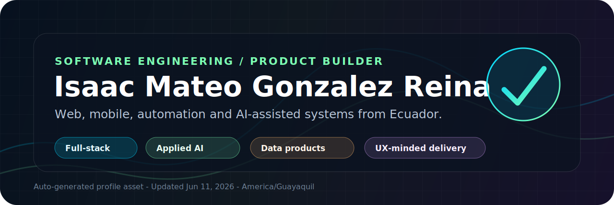
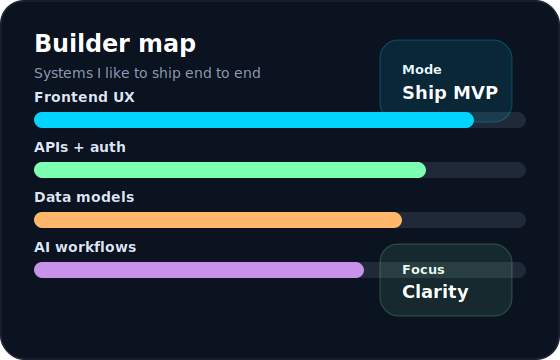
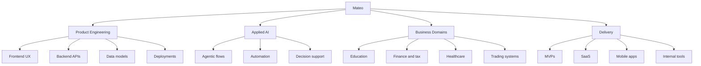
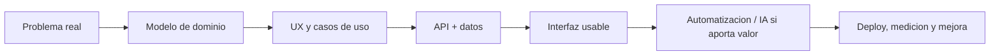

  <picture>
    <source media="(prefers-color-scheme: dark)" srcset="./assets/profile-banner.svg">
    
  </picture>

  
  
  

  

<table>
  <tr>
    <td width="58%">
      <h2>Construyo productos que se pueden explicar, usar y escalar</h2>
      

        Soy <strong>Isaac Mateo Gonzalez Reina</strong>, estudiante de Ingenieria en Software en la ULEAM.
        Trabajo entre frontend, backend, datos, automatizacion e IA aplicada. Me interesan los sistemas que resuelven
        problemas reales: asignacion universitaria, SaaS tributario, plataformas academicas, bots con gestion de riesgo
        y apps moviles colaborativas.
      

      

        Mi enfoque: entender el dominio, convertirlo en flujos claros, construir una base tecnica mantenible y cuidar
        la experiencia visual para que el producto se sienta confiable desde el primer click.
      

    </td>
    <td width="42%">
      
    </td>
  </tr>
</table>

## Proyecto Spotlight

<table>
  <tr>
    <td width="50%">
      <h3>Tributta</h3>
      
SaaS para contadores en Ecuador: matriz tributaria SRI, XML, conciliacion, ATS, indicadores y reportes.

      

        
        
        
        
      

      
<strong>Valor:</strong> producto de dominio fiscal, importacion de comprobantes, auditoria y despliegue reproducible.

    </td>
    <td width="50%">
      <h3>BotScriptSpot / BS-Trade</h3>
      
Bot de trading en Binance Testnet con analisis multi-timeframe, 7 confluencias, riesgo estricto y alertas.

      

        
        
        
        
      

      
<strong>Valor:</strong> automatizacion con reglas, control de riesgo, monitoreo y reportes operativos.

    </td>
  </tr>
  <tr>
    <td width="50%">
      <h3>SA-2025-2</h3>
      
Gestor de asignacion de cupos para universidades con autenticacion, datos y flujos de decision.

      

        
        
        
        
      

      
    </td>
    <td width="50%">
      <h3>HackIAthon</h3>
      
Estimador agentico de copago y cobertura medica: producto construido alrededor de decision support.

      

        
        
        
      

      
    </td>
  </tr>
</table>

  
<strong>Mas sistemas que cuentan parte de mi trabajo</strong>

   

| Proyecto | Lo que demuestra | Tecnologias |
|---|---|---|
| `edukioacademy` | Gestion academica, tutoria, horarios, records e integraciones Microsoft/Google | NestJS, Angular, TypeORM, PostgreSQL |
| `SharedList` | App movil colaborativa con carpetas, listas, codigos de invitacion y permisos | React Native, Expo, Supabase |
| `SA-2025-2` | Sistema universitario de asignacion de cupos con datos y autenticacion | Django, Supabase, Pandas, JWT |
| `SellPerfect` | App web para servicios electricos y gestion operativa | Django, templates, datos |
| `FISHMEALPRO` | Plataforma full-stack con frontend Angular y backend Node/Nest | Angular, Node, PostgreSQL |
| `landingMoonDevs` / demos | Landing pages y experiencias visuales de alta conversion | Next.js, Tailwind, Vite, React |

## Stack Operativo

  

<table>
  <tr>
    <td><strong>Frontend</strong></td>
    <td>React, Next.js, Angular, Vue, Vite, Tailwind, shadcn/ui, Framer Motion</td>
  </tr>
  <tr>
    <td><strong>Backend</strong></td>
    <td>NestJS, Node.js, Django, FastAPI, REST APIs, auth, roles, integrations</td>
  </tr>
  <tr>
    <td><strong>Data</strong></td>
    <td>PostgreSQL, Supabase, Prisma, TypeORM, Pandas, reporting, migrations</td>
  </tr>
  <tr>
    <td><strong>Product</strong></td>
    <td>Discovery, MVPs, dashboards, domain modeling, UX writing, deployment-ready docs</td>
  </tr>
</table>

## Senales Vivas

  
  

  
  

  

## Flujo De Trabajo

## Contribuciones

  <picture>
    <source media="(prefers-color-scheme: dark)" srcset="https://raw.githubusercontent.com/ElRascuacho/ElRascuacho/output/github-contribution-grid-snake-dark.svg">
    <source media="(prefers-color-scheme: light)" srcset="https://raw.githubusercontent.com/ElRascuacho/ElRascuacho/output/github-contribution-grid-snake.svg">
    
  </picture>

  <strong>Abierto a colaborar en productos web, automatizacion, IA aplicada y sistemas que necesiten claridad tecnica desde el primer prototipo.</strong>

